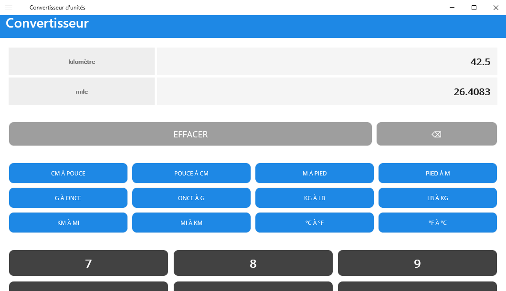
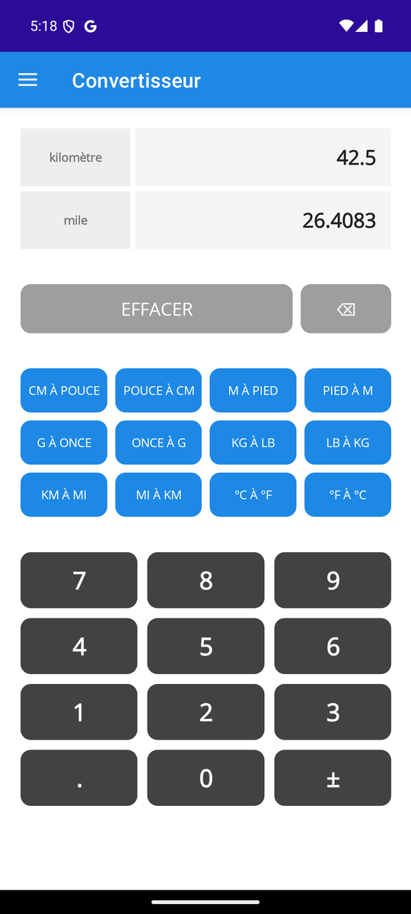
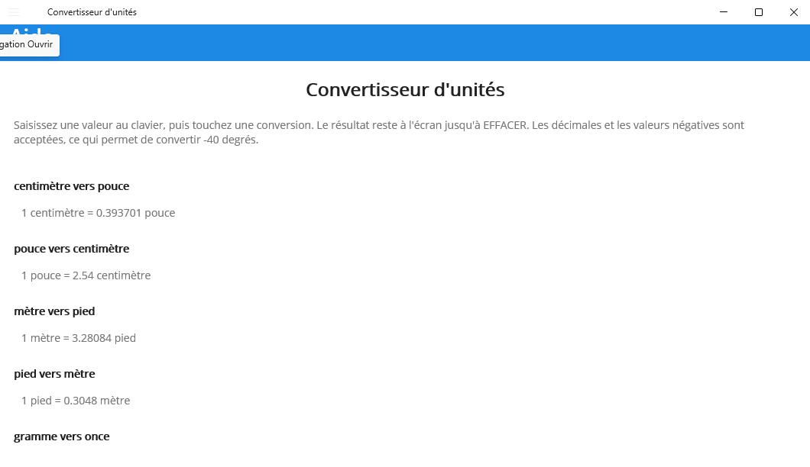

# unit-converter

[](https://github.com/Arthure-code/unit-converter/actions/workflows/build.yml)
[](https://sonarcloud.io/summary/new_code?id=Arthure-code_unit-converter)
[](https://sonarcloud.io/summary/new_code?id=Arthure-code_unit-converter)
[](https://sonarcloud.io/summary/new_code?id=Arthure-code_unit-converter)
[](https://sonarcloud.io/summary/new_code?id=Arthure-code_unit-converter)
[](https://sonarcloud.io/summary/new_code?id=Arthure-code_unit-converter)
[](https://sonarcloud.io/summary/new_code?id=Arthure-code_unit-converter)
[](https://sonarcloud.io/summary/new_code?id=Arthure-code_unit-converter)

A unit converter with a keypad of its own: type a number, press a conversion, read the result. Twelve conversions, five pairs of units and the two temperatures.

.NET MAUI on .NET 9, built and run on Windows and Android. The rules live in a class library the screens ask, so they are read and tested without an interface.

## Screenshots

**The converter**



**The same page on a phone**



**The help**



## How it works

**The conversion is not in the screen.** Each key carries the name of the conversion it asks for, and one method answers for all twelve. The arithmetic belongs to a catalogue the keypad never sees. Before, twelve buttons meant twenty-four handlers repeating the same six lines, and the two temperatures repeated them twice more.

**A conversion and its inverse are the same number.** Each pair is declared once with its international definition, 2.54 centimetres per inch, 0.3048 metre per foot, 0.45359237 kilogram per pound, and read backwards by computing the inverse. A value converted and converted back comes home to itself, which two separately rounded factors never quite do.

**Zero is a number.** A leading zero is dropped as soon as a digit follows it, so nothing reads 05, but zero alone converts like any other value. It could not before.

**The keypad types decimals and negatives.** Which is what makes -40 degrees convertible, the one temperature that reads the same on both scales.

**The help page is read from the catalogue.** Each line is the conversion describing itself, so what the page says and what the application computes cannot drift apart.

**Sixty-six tests.** The conversions against their defined values, every pair through its round trip, and the keypad rules one by one: the leading zero, the single decimal point, the sign, the backspace, the length of the display, and what counts as a number worth converting.

## Running it

On Windows:

```bash
dotnet run --project src/UnitConverter.App -f net9.0-windows10.0.19041.0
```

On Android, with a device or an emulator attached:

```bash
dotnet build src/UnitConverter.App -t:Run -f net9.0-android35.0
```

```bash
dotnet test UnitConverter.sln
```

## Résumé

Convertisseur d'unités en .NET MAUI, sur Windows et Android. Douze conversions, cinq paires d'unités et les deux températures, avec un pavé numérique maison. Les règles ne sont pas dans l'écran : elles vivent dans une bibliothèque de classes que les pages interrogent, ce qui les rend lisibles et testables sans interface. Chaque touche porte le nom de la conversion qu'elle demande, et une seule méthode répond pour les douze, là où il y avait vingt-quatre gestionnaires qui répétaient les mêmes lignes. Chaque paire d'unités est déclarée une fois avec sa définition internationale et lue à l'envers en calculant l'inverse, de sorte qu'une valeur convertie puis reconvertie revient sur elle-même. Le zéro seul se convertit, le pavé accepte les décimales et le signe négatif, et la page d'aide est lue du catalogue plutôt qu'écrite à la main. Soixante-six tests couvrent les conversions et les règles de saisie.

## Licence

MIT. See [LICENSE](LICENSE).
